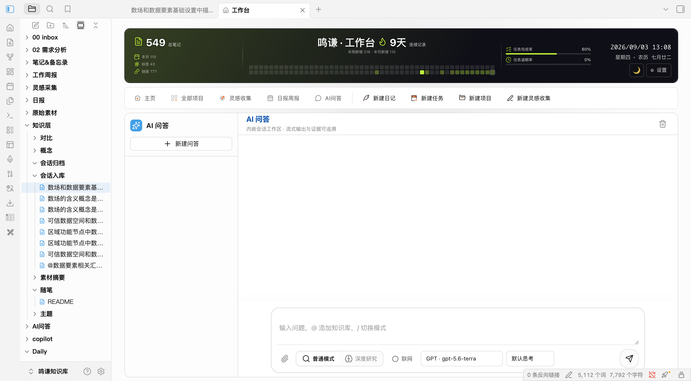

# Dashboard — Obsidian 个人工作台插件

Dashboard 是一个 Obsidian 插件：把「任务管理 / 项目管理 / 笔记统计 / 灵感收集」收进一个页面，数据全部存在本地文件里，不依赖任何外部服务或账号。

## 功能

### 主页
- **顶部横幅**：更换封面图片、拖拽调整纵向位置，可切换封面模式或统计模式并配置统计指标
- **Vault Pulse**：笔记总数 / 未完成任务 / 今日新增 / 连续天数，自动刷新
- **快速捕捉**：输入即在 Vault 新建笔记，支持模板与命名规则
- **TODO**：每日任务，逾期置顶 + 优先级排序；右键菜单管理，支持单日延后、单日完成/不做，支持重复任务
- **工作进度**：今日 / 全部完成率双环形图
- **本周待办 & 逾期提醒**：本周待办任务及逾期任务提醒
- **历史完成待办**：集中查看所有项目已完成的任务，按最近完成时间倒序展示
- **项目情况**：阶段管道（阶段名与数量可在设置里自定义，4–6 段）
- **笔记统计**：52 周热力图
- **项目日历**：直接引用项目任务数据，支持打开完整项目日历弹窗
- **番茄计时**：专注计时、活动标签、专注记录与统计弹窗
- **倒计时**：年度剩余天数 / 周数 / 完成百分比（支持自定义事件）
- **首页布局**：卡片可手动添加、拖动排序和调整尺寸，布局自动保存
- **深浅双模式**：支持一键切换深色或浅色模式
- 

### 全部项目
- **甘特图**：SVG 时间轴，日 / 周 / 月 / 季度缩放，今日线居中；拖拽改起止日期、跨项目移动任务，按状态多选筛选；悬浮时间块左右边缘可拖拽调整开始 / 结束时间
- **列表**：列排序、状态筛选、右键菜单
- **日历**：月视图，格子内任务条，拖拽改截止日期
- **看板**：待办 / 进行中 / 已阻塞 / 已完成 / 已取消，跨列拖拽即改状态


### 操作与交互优化
- **横幅设置**：顶部横幅提供“更换图片”“横幅设置”、深浅主题切换和插件设置入口
- **顶部导航**：工作台使用主页图标；可直接进入日报周报，或快速新建日记、任务、项目和灵感收集
- **项目看板**：所有状态列共享宽度，拖动任意列右侧边缘即可统一调整
- **甘特图列表**：任务树按父子层级连线展示；左侧任务名称区域支持拖动改宽，过长名称悬浮显示完整内容
- **项目日历**：任务条支持点击编辑、右键打开源文件或删除，日期调整后同步回任务文件
- **灵感看板**：支持跨列拖动和列宽调整，标签与星标同排展示，右键可直接转为任务
- **灵感列表**：各列支持拖动改宽；“任务转化”显示关联任务数量，点击可查看并编辑关联任务
- **任务状态**：完成任务会进入历史完成待办；撤销完成状态后会同步修正对应日报


### 灵感收集
一套轻量的「收集 → 推进 → 归档」工作流，适合随手记灵感、点子、待跟进事项。所有条目统一存在单个 Markdown 文件里，数据全本地。
- **看板 / 列表双视图**：默认看板按阶段分列，可一键切换到列表视图
- **阶段管道**：收集箱 → 评估中 → 进行中 → 已完成 / 已放弃；阶段名称与配色均可在设置里自定义
- **拖拽管理**：跨列拖拽即改阶段，列内拖拽改排序
- **星标**：标记「重要 / 待跟进」，独立于阶段；可一键筛选「只看星标」
- **内联详情**：选中单阶段时，右侧实时编辑标题、备注、链接
- **链接关联**：每条可绑定一个链接（库内或外部），一键打开
- **标签与任务转化**：看板和列表展示标签；灵感可转为任务并保留关联关系
- **任务转化统计**：列表显示每条灵感关联的任务数，可打开关联任务并编辑
- **列表列宽调整**：状态、标签、创建时间、任务转化等列支持拖动调整宽度
- **右键菜单**：编辑 / 打开链接 / 切换阶段 / 星标 / 删除


### 日报周报
- **月历视图**：按月查看日报记录，支持年份 / 月份选择、上个月、今天、下个月切换
- **完成标记**：周六、周日显示“休”；当天有完成任务时显示绿色“日”，今天显示“今”
- **自动生成**：今日总结收集当天完成任务，明日计划收集本周内未完成任务；没有任务时显示 `---`
- **日报列表**：默认按月加载，支持按日期筛选，筛选跨度最长一年，每页 50 条
- **复制与导出**：支持一键复制整篇日报、复制今日总结、复制明日计划，并按当前筛选结果导出 CSV 或 Markdown 表格
- **月度文件**：日报保存在 Vault 根目录的 `日报/` 文件夹，文件名格式为 `yyyy-MM日报.md`

### AI 问答


- **会话工作区**：独立的新建、切换与删除会话；问答历史保存在 Vault 的 AI 问答会话目录，可将完成回答一键入库为 Markdown
- **检索范围**：默认检索本地 Vault Markdown；接入可选的 SAG 知识库 MCP 后，可通过 `@知识库名` 限定来源，也可在未选来源时跨已授权知识库检索
- **普通问答与深度研究**：普通模式用于快速查证；深度研究会执行多轮互补检索。分析型问题至少使用三个检索角度，并在界面中展示处理步骤
- **证据与引用**：SAG 结果按分块 ID 去重，过滤图片或摄入元数据等不可用内容；回答保留本地、知识库和联网来源，可展开查看原文摘录
- **联网搜索（可选）**：启用 Firecrawl MCP 后可搜索并抓取网页内容，联网结果会与知识库证据分开标识
- **模型与流式回答**：支持配置兼容 OpenAI Chat Completions 或 Responses 协议的模型；回答以流式 Markdown 呈现，完成后支持复制和重新回答
- **附件与输入体验**：可附加最多 8 个文件（单个不超过 15MB），支持粘贴文件；输入框高度会记住，用户问题文本可直接选中复制

> AI 问答不会内置模型密钥或第三方服务。SAG、Firecrawl 和模型供应商均需要在插件设置中单独配置；当外部服务不可用时，仍保留本地 Vault 检索，但无法生成模型回答。

### 性能与数据一致性
- 任务扫描支持短时缓存和进行中的扫描复用，避免主页、项目页、日报和统计模块重复遍历 Vault
- 连续任务变更会合并日报同步请求，月度日报文件按文件串行写入，降低并发覆盖风险
- 日报列表按月份或日期范围加载，避免历史记录全部进入页面 DOM
- 可选的噪声背景使用一次性低分辨率纹理，不持续占用渲染线程


## 安装

将 `mq-obsidian-dashboard` 文件夹放入 `<你的库>/.obsidian/plugins/` 目录，然后在 Obsidian 命令面板执行 **Reload app without saving**（或重启 Obsidian）即可。

## 数据格式

数据不进数据库，全部是 Vault 里的 Markdown 文件 + 中文 frontmatter 键名。

- **项目** = `项目文件夹/` 目录，内含 `project-{项目名}.md` 存项目元信息
- **任务** = 项目文件夹内的 `.md` 文件（`project-*.md` 除外）
- **每日节点** = 任务正文 `## 每日节点` 列表
- **灵感收集条目** = 统一存于单个 Markdown 文件（默认 `看板.md`）的 frontmatter 数组
- **日报** = `日报/` 目录下按月份保存的 Markdown 文件，任务完成后自动更新

任务文件示例：

```yaml
---
状态: 待办            # 待办 / 进行中 / 已阻塞 / 已完成 / 已取消
优先级: 重要且紧急     # 重要且紧急 / 重要不紧急 / 紧急不重要 / 不重要不紧急
开始日期: 2026-01-01
截止日期: 2026-01-15
项目: MyProject
tags: ["任务"]
类型: 普通            # 普通 / 重复
---
```

项目元数据 `project-{项目名}.md`：

```yaml
---
项目名称: MyProject
项目类型: 阶段项目     # 阶段项目 / 非阶段项目
颜色: "#3b82f6"
tags: [配置]
描述: 项目描述
开始日期: 2026-01-01
结束日期: 2026-06-30
---
```
